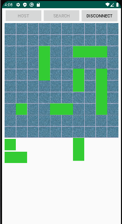
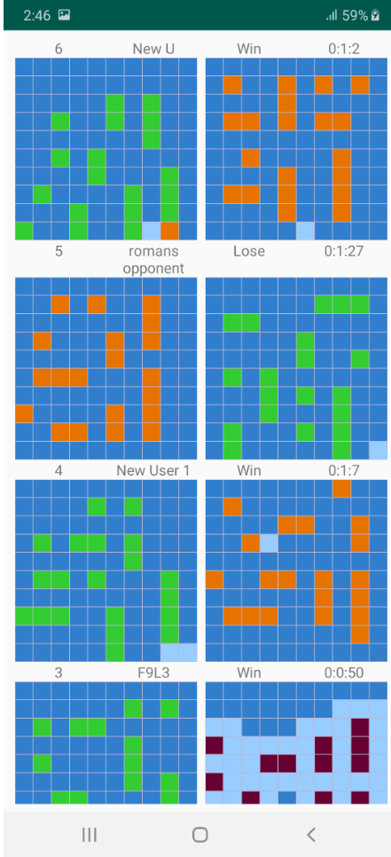

# Battleship

Project completed during Android course. Constitutes an android implementation of simple multiplayer battleship game. Application supports only player vs player mode via google nearby connections library.

## Game flow

Each player can set a nickname for themselves and either search for a game or host one. Players can set up their ships either before or during search for opponent.

After both players set up their ships and pressed ready button match begins and players take turns playing the game, until one of them wins. Each turn is accompanied by snack notification for both players about its result.

After match player can check their statistics, which includes both his and opponent's fields at the end of the game without fog of war.

## Communication between devices
Google nearby library is used for communication between devices. To set up a match on of a players must become a host and another must connect to him via search.

Upon establishing connection application waits for either ready payload or payload with opponents nickname. Once both players are ready and game starts application creates loop of payloads: payload with players turn is sent to opponent, opponent sends back a payload with information about shot result: whether it was miss or hit. From this information it is decided which players turn is next application either waits for player input or opponents payload.

After game is over payloads with player fields are exchanged for statistics.